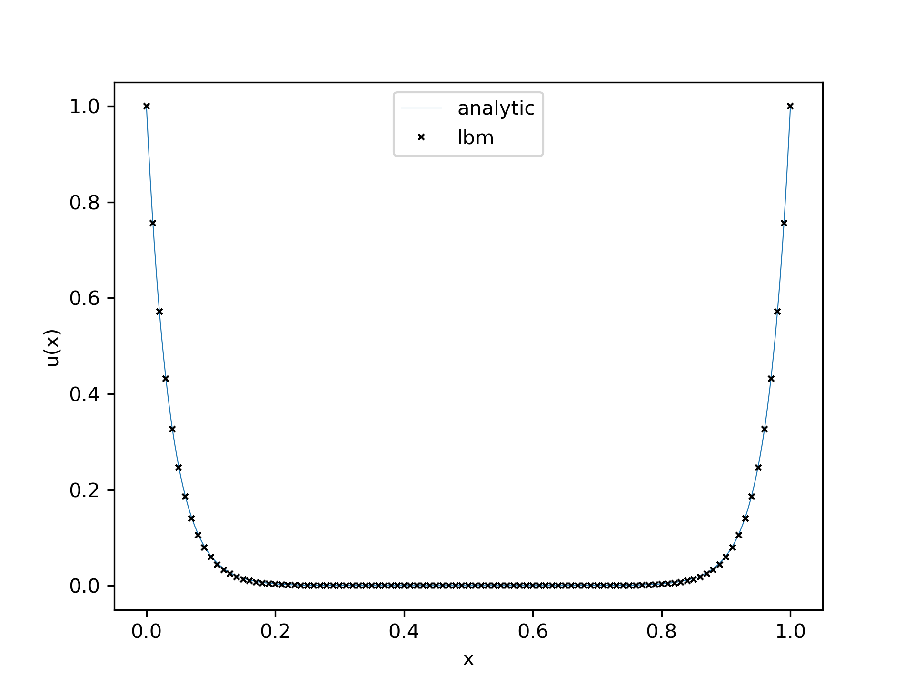

# Poisson's Equation Lattice

Figure 1 from [Chai & Shi](https://www.sciencedirect.com/science/article/pii/S0307904X07001722?via%3Dihub) (This is not the chai-shi model, this is modified BGK)

The Poisson-Boltzmann equation:

$$\Delta u = \beta sin(\gamma u)$$

Analytic solution:

$$u(x) = \frac{e^k-1}{e^k-e^{-k}}e^{-kx} + \frac{1-e^{-k}}{e^k-e^{-k}}e^{kx}$$

Dirichlet Boundaries are kept at: 
$$
\begin{cases}
    u(0) = 1.0\\
    u(1) = 1.0
\end{cases}
$$

Typo in the manuscript:

$$D = \alpha c^2(1/2 - \tau)\Delta t \rightarrow should\ be\ \rightarrow D = \alpha c^2(\tau - 1/2) \Delta t$$
